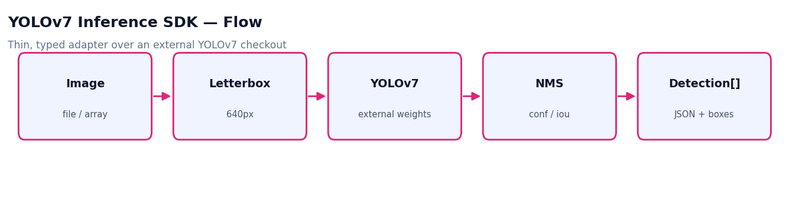
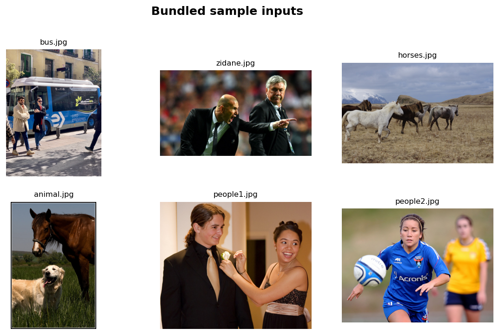

# YOLOv7 Inference SDK


A thin **adapter layer for running YOLOv7 inference** from an external YOLOv7 checkout. It keeps this repository focused on integration code: typed detection records, JSON export, and OpenCV annotation utilities. The upstream YOLOv7 implementation and `.pt` weights are intentionally not vendored.



## Features

- Load YOLOv7 from an external repository path.
- Run inference on an image file or an already-loaded image array.
- Return detections as structured `Detection` objects.
- Draw detections with a small OpenCV annotation helper.
- Export detections to JSON and annotated images.

## Python API

```python
from pathlib import Path
import cv2
from yolov7_inference_sdk import YoloV7Detector, draw_boxes

image = cv2.imread("images/bus.jpg")
detector = YoloV7Detector(Path(r"C:\work\external\yolov7"), Path("models/yolov7.pt"))
detections = detector.detect_array(image)
annotated = draw_boxes(image, detections)
```

## Project Structure

```text
yolov7-inference-sdk/
├── assets/                  # workflow diagram + sample gallery
├── external/                # external YOLOv7 checkout notes
├── images/                  # bundled sample inputs
├── models/                  # local weight placeholder (git-ignored)
├── scripts/                 # CLI example (detect_image.py)
└── yolov7_inference_sdk/    # maintained SDK code
```

## Installation

```powershell
python -m venv .venv
.\.venv\Scripts\activate
pip install -r requirements.txt
```

## Usage

Clone YOLOv7 outside this repository and place local weights at `models/yolov7.pt`:

```powershell
git clone https://github.com/WongKinYiu/yolov7 C:\work\external\yolov7
python scripts/detect_image.py --image images\bus.jpg --weights models\yolov7.pt --yolov7-repo C:\work\external\yolov7
```

Or set the repo path via an environment variable:

```powershell
$env:YOLOV7_REPO = "C:\work\external\yolov7"
python scripts/detect_image.py --image images\bus.jpg --weights models\yolov7.pt
```

Outputs: `outputs/detections.json` and `outputs/detected.jpg`.

## Sample Inputs

The repository bundles a few small sample images for quick testing:



## Roadmap

- Add batch-image and video examples.
- Add tests for detection serialization and annotation rendering.
- Add packaging and versioned releases.
- Add CPU/GPU notes and benchmark timings.

## License

Released under the [MIT License](LICENSE). YOLOv7 is a separate project under its own license.
